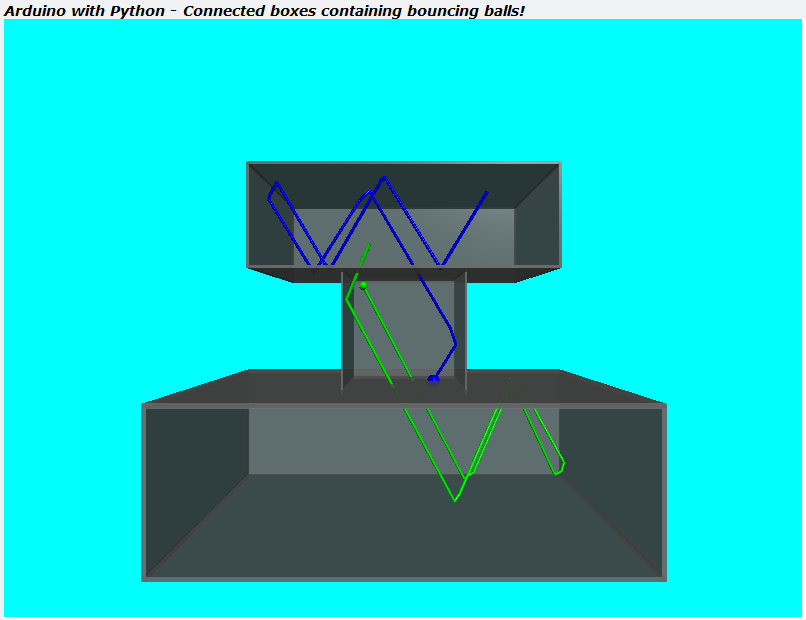

# TTB-AP-Lesson14
My Solution to Paul McWhorter's "Arduino with Python: LESSON 14" homework.

Visit Paul's video here:
 - https://youtu.be/watch?v=JA4UbI2v0EA

You can get Paul's code here:
 - https://toptechboy.com/

You can see my solution demonstrated here:
 - https://youtu.be/eAIqPtYn5ko

This week it is again all about the python code and parametric design. I have drawn two boxes, or arenas, and a tunnel linking them. In each arena there is a ball bouncing around, and they are free to move between the arenas via the linking tunnel. All this is again essentially from 2 parameters, an arena position and size. Everything else is relative, especially the tunnel that links the two arenas.

I still have some thinking to do... but for now, I had to cheat to get it to work - my bouncing and collision detection code assumes the ball has no radius.

## My Connected Boxes with Bouncing Balls - Parameterised:

